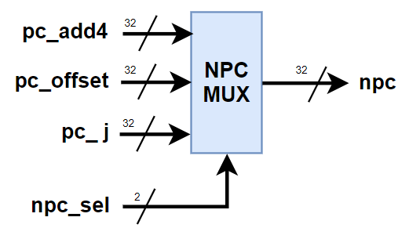
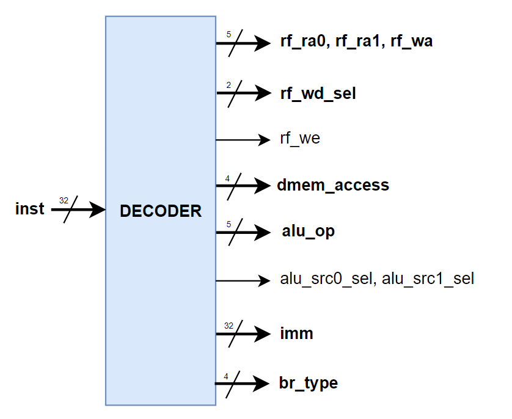
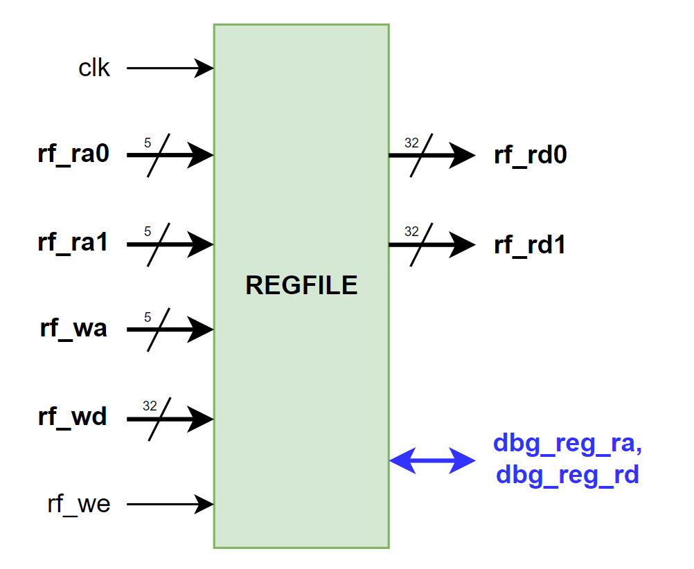
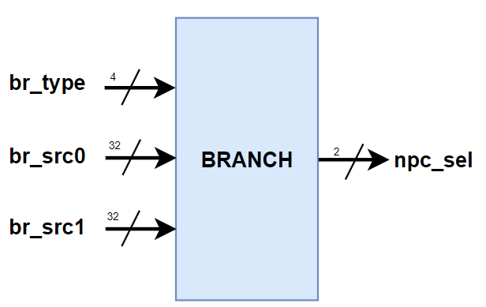
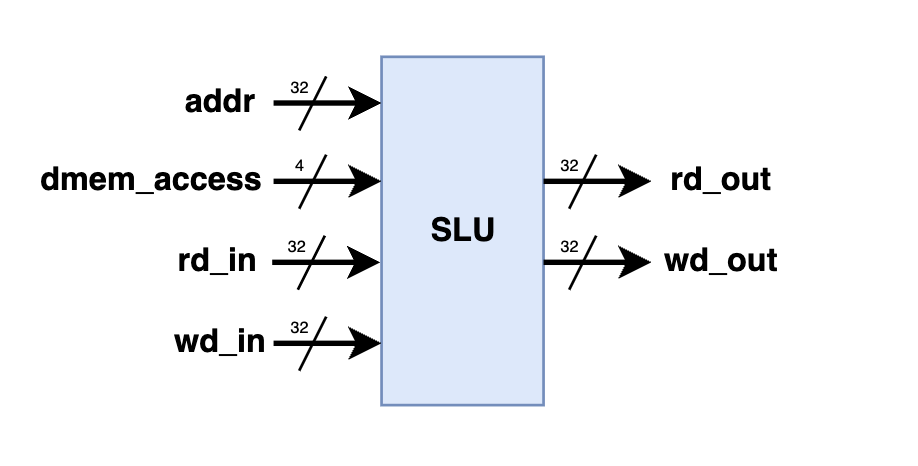

#### 由于GitHub对数学公式的支持不够好，本文档的公式可能无法正常显示。文字部分请下载PDF版本查看：`README.pdf`。
# 
 简单的单周期CPU设计 

## 
 俞嘉权 PB22010390 

#### 
 2024年春季学期，计算机组成原理实验 

### 目标
基于 $RISC-V$ 指令集架构，设计一个完整的单周期CPU，这一CPU支持基础的算术与逻辑运算指令与跳转和访存功能。

### 设计概述
实现这一简单的单周期CPU所需要的模块为：
1. 程序计数器（PC）
2. 指令内存（INST_MEM）
3. 译码器（Decoder）
4. 寄存器文件（Regfile）
5. 算术逻辑单元（ALU）
6. 分支控制模块（Branch）
7. 访存控制单元（SLU）
8. 数据内存（DATA_MEM）
9. 选择单元（MUX）

  <b>Datapath of CPU</b>  

数据通路如图，使用verilog语言完成这些设计。

#### 程序计数器
代码及具体过程的注释可见于 `PC.v` ，`ADD4.v` 与 `MUX2.v`（这些设计代码可以在 `designs` 文件夹里看到）。

在CPU中，PC寄存器时刻存储了正在执行的指令的地址。它的功能是将当前指令的地址传递给指令存储器，从而读出此时正确的指令内容。同时，它也需要能够接受下一条指令地址的输入，并在时钟上升沿到来时更新自己的值，从而实现了指令的连续运行。

寄存器的写入操作应当在每个时钟周期内进行；因而，CPU的PC寄存器理论上是不需要使能信号的。这里保留使能信号是用于便于我们的调试，是为了在FPGA上运行我们的设计时，可以引入来自PDU的控制逻辑；使我们在调试的时候可以在合适的时机使CPU停下来以观察CPU的执行情况。在复位PC寄存器时，我们将其复位为 $0x00400000$ ，这是 $RV32I$ 指令集程序段的起始地址。$RV32I$ 是32位架构，按字节寻址，一条指令（一个字）为4字节，因此ADD4模块中PC的自增量为4，在向指令内存INST_MEM取指时，直接略去PC的末2位（32位机器的内存中的一个位置存储32位数据，即一个字，4字节）。ADD4模块中还有一个停机判断，若停机信号为真，则PC不再自增，保持当前值；在 $RV32I$ 架构中，停机指令为 $0x00100073$ ，即 $ebreak$ 指令。

  <b>Schematic of NPC-MUX</b>  

如图，选择单元NPC-MUX选择下一个周期给到PC寄存器的值，它可以是自增后的 $pc\_add4$ （无分支和跳转），也可以是来自 $ALU\_res$ 的 $pc\_offset$ （有分支和跳转）； $jalr$ 指令要求将最低位置为 $0$ ，因此端口 $pc\_j$ 是 $ALU\_res$ 与 $\sim 1$ 按位与的结果。选择信号 $NPC\_{sel}$来自分支控制模块Branch。

#### 译码器
代码及具体过程的注释可见于 `Decoder.v`。

  <b>Schematic of Decoder</b>  

译码器是CPU的心脏，它负责根据输入的指令生成相应的控制与数据信号。各个输出端口的作用是：
- alu_op：ALU 的运算模式码；
- imm：经过扩展的立即数；
- rf_ra0、rf_ra1：寄存器堆的读地址；
- rf_wa：寄存器堆的写地址；
- rf_we：寄存器堆的写使能；
- alu_src0_sel、alu_src1_sel：ALU 的源操作数选择信号；
- dmem_access：访存类型；
- rf_wd_sel：寄存器堆写回数据选择器的选择信号；
- br_type：分支跳转的类型；
- ifhalt：是否停机。

译码器模块是一个巨大的组合逻辑单元，所有的信号都根据 $inst$ 的数值结合对应指令集的译码规则得出。若一条指令中没有某个输出信号，则该信号在当前周期不起作用，只需要保证起作用的信号是正确的即可。为方便仿真调试的时候看得清晰，我的设计中将当前指令中没有的信号都赋为 $0$ 。

#### 寄存器文件
代码及具体过程的注释可见于 `RegFile.v` 。

  <b>Schematic of Regfile</b>  

如图，寄存器文件是一个 $32 \times 32$ 的寄存器堆，$rf\_{ra0} - rf\_{rd0}$、$rf\_{ra1} - rf\_{rd1}$ 为数据读取端口；$rf\_{wd} - rf\_{wa}$ 为数据写入端口；$rf\_{we}$ 为写使能信号。读端口、写端口和写使能信号都是由译码器Decoder提供的。寄存器文件的写入操作应当在每个时钟上升沿进行，读操作是时钟异步的（实际上是组合逻辑），即只要地址给定，对应寄存器的数值就能读出，而无需等待时钟边沿的到来。我们的 CPU 并没有对寄存器进行复位的功能需求。用户在编写汇编程序时，除了 $0$ 号寄存器始终为 $0$ 之外，不应当假定任何寄存器具有固定的初始值；因此，我们在实现 CPU 时，也取消了寄存器堆的复位端口信号。debug 接口 $debug\_reg\_ra$、$debug\_reg\_rd$。这一对端口与数据读端口功能一致，只用于仿真与上板时的调试。CPU 在正常运行时并不会用到这两个端口。

#### 算术逻辑单元
代码及具体过程的注释可见于 `ALU.v` 。

  <b>Schematic of ALU</b>  

ALU是一个组合逻辑单元，根据输入的操作码 $alu\_op$ 选择对应的运算模式。ALU的输入是两个操作数 $alu\_src0$ 和 $alu\_src1$ ，输出是运算结果 $alu\_res$ 。ALU的运算模式有加法、减法、有符号比较、无符号比较、与、或、异或、左移、逻辑右移、算术右移、源操作数0、源操作数1。这些运算模式的选择是由译码器Decoder提供的。这套OP码是根据 $LV32R$ （LoongArch，龙芯公司）指令集架构设计的，这是为了便于代码复用到LoongArch时的Decoder译码逻辑的编写，故我前文基于RISC-V的译码器编写反而会略显繁琐。一些细节是verilog的数据类型默认是无符号数，移位运算的移位位数只取操作数的后 $5$ 位。

#### 分支控制模块
代码及具体过程的注释可见于 `Branch.v` 。

  <b>Schematic of Branch</b>  

分支控制模块Branch是一个组合逻辑单元，根据输入的分支类型 $br\_type$ 和两个操作数 $br\_src0$ 和 $br\_src1$ ，选择下一个周期的PC值。分支类型有 $BEQ$、$BNE$、$BLT$、$BGE$、$BLTU$、$BGEU$、$JAL$、$JALR$。分支类型的选择 $br\_type$ 由译码器Decoder提供。对于 $BEQ$、$BNE$、$BLT$、$BGE$、$BLTU$、$BGEU$，将根据两个操作数的比较结果选择下一个周期的PC值（不跳转为选择 $pc\_add4$ ，跳转为选择 $pc\_offset(=Alu\_res)$ ）；对于 $JAL$、$JALR$分别选择 $pc\_offset$ 和 $pc\_j(=pc\_offset\,\,\&\, \sim 1)$ 。Branch输出的这一选择信号给到选择单元NPC-MUX作为选择信号进行下一周期PC值的选择。

#### 访存控制单元
代码及具体过程的注释可见于 `SLU.v` 。

  <b>Schematic of SLU</b>  

访存控制单元SLU是一个组合逻辑单元，根据输入的访存类型 $dmem\_access$ 和访存地址 $addr$ ，选择对应的访存操作。模块SLU有7个输入和3个输出。输入包括32位地址 $addr$ 、4位内存访问类型 $dmem\_access$ 、两个32位数据输入 $rd\_in$ 和 $wd\_in$ 。输出包括两个32位数据输出（$rd\_out$ 和 $wd\_out$ ）和一个内存写使能信号（$dmem\_we$）。$rd\_in$ 和 $wd\_out$ 是与数据内存相连的，进行读操作时，SLU根据具体的读类型处理从数据内存中加载来的 $rd\_in$ 作处理，并作为 $rd\_out$ 输出给寄存器堆写回选择器；进行写操作时，SLU根据具体的写类型将 $rd\_in$ 的部分位或全部位替换为写入数据 $wd\_in$，再作为写数据 $wd\_out$ 传给数据内存。

访存类型有 $LW$（加载字）、$LH$（加载半字）、$LB$（加载字节）、$LHU$（无符号加载半字）、$LBU$（无符号加载字节）、$SW$（存储字）、$SH$（存储半字）、$SB$（存储字节）。这些访存类型的选择由译码器Decoder提供。对于全字和半字读写，模块内部使用half_word_aligned和whole_word_aligned，用于检查地址是否对齐到半字或全字，若地址不对齐，将禁止读写操作。读操作是时钟异步的（实际上是组合逻辑），即只要地址给定，对应存储器的数据就能读出，而无需等待时钟边沿的到来。写操作应当在每个时钟上升沿进行。一个需要注意的细节是 $RV32I$ 是一个小端架构，即低地址存放低位数据，高地址存放高位数据，并且在写操作的半字或字节写入时，写入寄存器数据中的低位。

#### 选择单元
代码及具体过程的注释可见于 `MUX.v` 与 `MUX2.v` 。

一位的多路复用器MUX用于ALU的源操作数的选择，两个MUX分别用来在 $pc$ 和 $rs_1$ 之间以及 $imm$ 和 $rs_2$ 之间选择ALU的源操作数。两位的多路复用器分别是NPC-MUX（NPC选择器）和RF-WD-MUX（寄存器堆写回选择器），用于选择下一个周期的PC值和选择寄存器堆的写回数据；这两个多路复用器的选择信号分别由Branch和Decoder提供。

#### 指令内存与数据内存
指令内存IM与数据内存DM使用EDA软件（如vivado）自带的IP核生成，其功能是存储指令和数据。指令内存的输入是PC的值，输出是对应地址的指令；数据内存的输入是访问地址和经过SLU处理的写入数据与写使能信号，输出访问地址处的数据同时对数据内存进行写操作（若写使能为真）。指令内存的初始化文件是机器码指令文件的coe文件，数据内存也可以用coe文件初始化（如果有需要）。准确地说，内存单元并不属于CPU体系。

#### CPU顶端设计
代码及具体过程的注释可见于 `CPU.v` 。

CPU顶端的设计，只需结合数据通路，连接和例化各模块即可；设计中的 $commit$ 和 $debug$ 形式的端口是用于上板时利用PDU进行调试、测试设计成果的。

### 实验测试

#### 仿真测试

仿真测试的代码可见于 `CPU_testbench.v` （仿真代码可在 `sims` 文件夹里看到）。可以使用 rars 或者其他的RISC-V汇编器生成的机器码指令文件，然后将其转换为 verilog 的初始化文件（coe文件）初始化指令内存IP核，然后将其加载到EDA软件的仿真器中进行仿真测试。

我提供了一些测试用例和汇编器 rars ，可在 `tests` 文件夹里看到（ rars 需要在有安装和配置 java 环境的情况下使用）。

#### 上板测试

上板测试的框架如图所示，通过PDU进行调试、测试设计成果。

  <b>Framework of FPGA Test</b>  

这一框架可见于文件夹 `vsrc` ，其中的 `TOP.v` 是整个设计的顶层，在其中已经实例化了PDU、CPU、内存模块并把端口连接。数据通路如图：

  <b>Datapath of FPGA Test</b>  

上板约束文件可见于 `constraints.xdc` ；板上控制单元PDU在上板时的调试方法，可以参考[PDU使用手册](https://soc.ustc.edu.cn/COD/lab3/PDU_intro/)。
