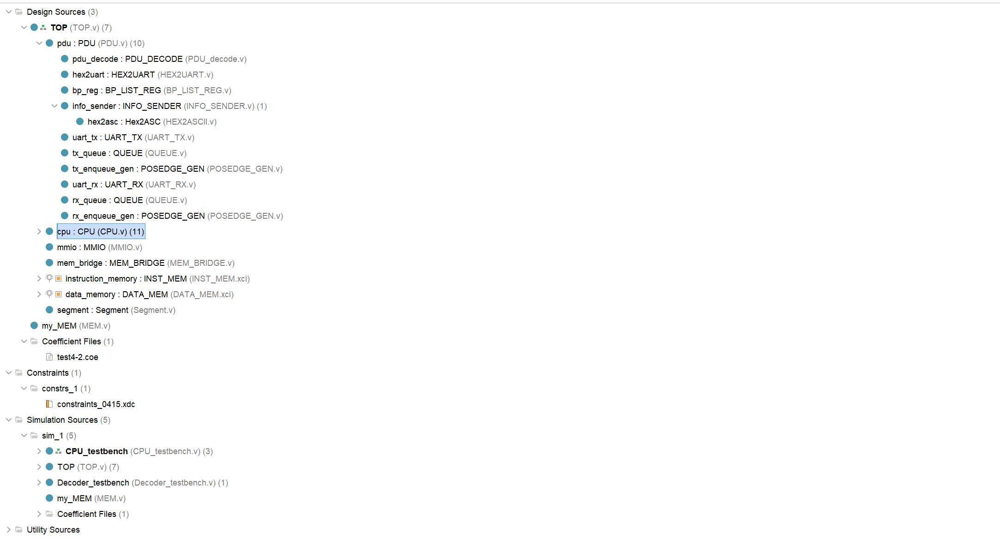
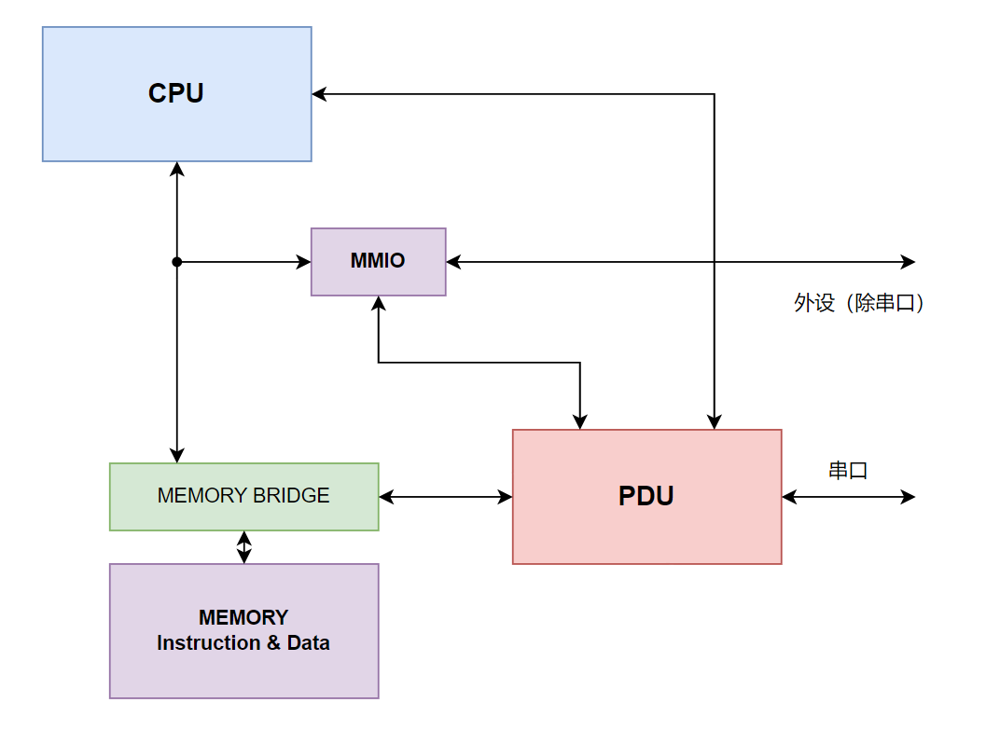

### 仿真测试

可以使用 rars（ rars 需要在有安装和配置 java 环境的情况下使用）或者其他的 RISC-V 汇编器对写好的用于测试的汇编程序生成机器码指令文件（coe文件），这是 verilog 用于初始化内存 IP 核的文件。在EDA软件（如 vivado ）中用 coe 文件初始化指令内存的 IP 核后，即可在EDA软件的仿真器中进行仿真测试。

仿真测试的代码见 `CPU_testbench.v` ，同时还提供了 RISC-V 的汇编器 rars 与几个测试用例。

### 上板测试

我们在FPGA开发板上测试时通过板上控制单元 PDU 进行调试、测试设计成果。PDU 在上板时的调试方法，可以参考[PDU使用手册](https://soc.ustc.edu.cn/COD/lab3/PDU_intro/)。上板测试的框架如图所示：

  <b>Framework of FPGA Test</b>  

这一框架可见于文件夹 `vsrc` ，其中的 `TOP.v` 是整个设计的顶层，在其中已经实例化了PDU, CPU与内存模块并且把端口连接。数据通路如图：

  <b>Datapath of FPGA Test</b>  

上板约束文件见 `constraints.xdc` ，其中的约束文件是针对中国科大实验室的开发板的，如果使用其他型号开发板，需要修改约束文件。中国科大提供在线使用FPGA开发板的服务，网址：[https:fpgaol.ustc.edu.cn](https:fpgaol.ustc.edu.cn)。